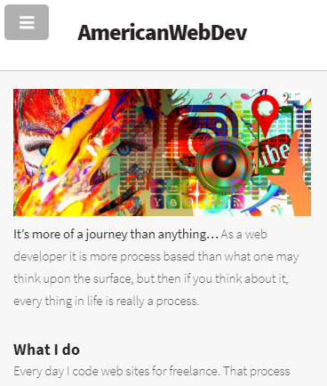

<h1>Portfolio Site with Jekyll</h1>


<h2>DESCRIPTION</h2>
<p>A Portfolio Site using Jekyll to serve Blogs:</p>
<p>Learn a little more about me and the projects that I've worked on. 
I also provide some tips and articles that will hopefully help with the 
code process and building your business identity. 

<h3>Image credits coming soon</h3>
<p>****Any business Logo's used to portray project work, unless expressly stated, are not for reproduction at all****</p>

<h3>Let's Give Credit Where It's Due</h3>
<p>Special Thanks to Women Who Code and especially to Suze Shardlow from the UK who presented
an overview and 2 hour speed lecture on using Jekyll including helpful syntax to promote dry code. </p>

<h3>VIEW SITE:</h3>
<a href="https://elowskya.github.io/github-pages-workshop/">https://elowskya.github.io/github-pages-workshop/</a>


<footer>

<h4>If you would like to check out the code from the workshop</h4>

```
$ git clone https://github.com/SuzeShardlow/github-pages-workshop.git
$ cd github-pages-workshop
$ bundle install
$ bundle exec jekyll serve --watch
```

Then browse to `http://127.0.0.1:4000/github-pages-workshop/`.
</footer>